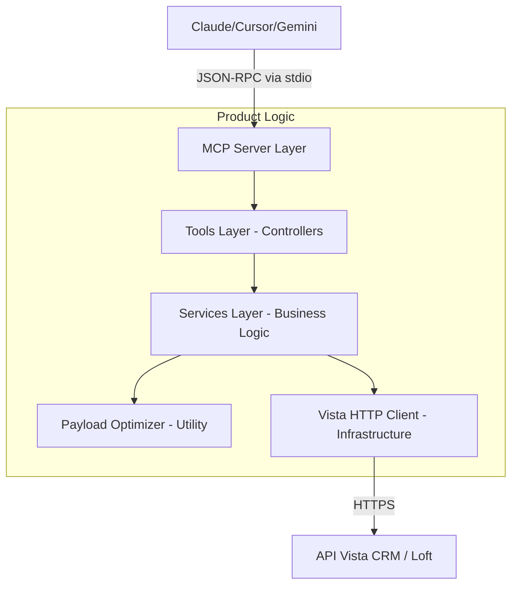

# MCP Server - Vista CRM Loft 🏠🚀

[](https://opensource.org/licenses/MIT)
[](https://modelcontextprotocol.io)
[](https://www.typescriptlang.org/)
[](https://github.com/fabiohsan-dev/mcp-vista-loft)

Integração de nível empresarial com a **API Vista CRM (Loft Edition)**, projetada especificamente para agentes de IA que precisam gerenciar operações imobiliárias complexas com precisão, segurança e economia de tokens.

Este servidor implementa o **Model Context Protocol (MCP)**, expondo mais de **40 ferramentas** que permitem a modelos de linguagem (LLMs) pesquisar imóveis, gerenciar o funil de vendas (Pipeline), capturar leads e controlar agendas de visitas.

---

### 🌟 Funcionalidades de Elite

- **🔍 Busca de Nova Geração:** Suporte a queries complexas via `imovel_busca_avancada` e filtros dinâmicos via `imovel_listar_conteudo`.
- **📈 Gestão de Funil (Pipeline):** Controle total de negociações e perfis de interesse do cliente.
- **💎 Otimização Inteligente de Contexto:** Processamento via `PayloadOptimizer` que remove ruído (nulls/vazios), reduzindo o consumo de tokens em até 60%.
- **🛡️ Resiliência em Produção:** Cliente HTTP customizado com tratamento de erros de negócio camuflados, timeouts e isolamento de falhas.
- **📊 Observabilidade Total:** Logs estruturados em `stderr` para monitoramento em tempo real sem interferir no protocolo de dados.

---

⚠️ **Segurança:** Este servidor manipula dados sensíveis de CRM. O uso em ambientes de produção deve ser monitorado para prevenir ataques de injeção de prompt que visem a exfiltração de dados privados.

---

## 🏗️ Arquitetura do Sistema

O projeto segue os princípios de **Clean Architecture**, garantindo manutenibilidade e facilidade de testes.



---

## 🚀 Instalação e Setup

### Pré-requisitos
- **Node.js 18.x** ou superior.
- **NPM** ou **Yarn**.
- Chave de API da **Vista Software**.

### Passo a Passo
1. **Clone o repositório:**
   ```bash
   git clone https://github.com/fabiohsan-dev/mcp-vista-loft.git
   cd mcp-vista-loft
   ```

2. **Instalação e Build:**
   ```bash
   npm install
   npm run build
   ```

3. **Configuração de Ambiente:**
   Crie um arquivo `.env` na raiz:
   ```env
   VISTA_URL=https://sua-instancia.vistahost.com.br
   VISTA_KEY=sua-chave-api
   DEFAULT_LIMIT=20
   TIMEOUT_MS=30000
   ```

---

## 🔌 Integração com Agentes de IA

### 1. Claude Desktop
Adicione ao seu arquivo de configuração:
- **Windows:** `%APPDATA%\Claude\claude_desktop_config.json`
- **macOS:** `~/Library/Application Support/Claude/claude_desktop_config.json`

```json
{
  "mcpServers": {
    "vista-crm-loft": {
      "command": "node",
      "args": ["/CAMINHO/ABSOLUTO/mcp-vista-loft/dist/index.js"],
      "env": {
        "VISTA_URL": "SUA_URL",
        "VISTA_KEY": "SUA_KEY"
      }
    }
  }
}
```

### 2. Cursor IDE
Vá em `Settings > Cursor Settings > MCP` e adicione um novo servidor:
- **Name:** `Vista CRM Loft`
- **Type:** `command`
- **Command:** `node /CAMINHO/ABSOLUTO/mcp-vista-loft/dist/index.js`

---

## 📋 Catálogo de Ferramentas (40+ ferramentas)

### 🏠 Módulo de Imóveis
| Ferramenta | Descrição |
|------------|-----------|
| `imoveis_pesquisar` | Busca padrão com filtros e ordenação. |
| `imovel_busca_avancada` | Execução de queries JSON complexas. |
| `imovel_detalhes` | Dados técnicos completos do imóvel. |
| `imovel_listar_conteudo` | Obtém valores únicos para filtros (ex: bairros ativos). |
| `imovel_prontuario` | Histórico detalhado e categorizado de eventos. |
| `imovel_fotos` / `anexos` | Gestão de mídia e documentação técnica. |

### 👥 Módulo de Clientes & Leads
| Ferramenta | Descrição |
|------------|-----------|
| `clientes_pesquisar` | Busca de contatos no CRM. |
| `lead_enviar` | Captura de leads de fontes externas (site/redes sociais). |
| `cliente_historico` | Log completo de interações com o cliente. |
| `cliente_favoritos` | Gestão de imóveis de interesse do contato. |

### 📈 Módulo de Pipeline & Negócios
| Ferramenta | Descrição |
|------------|-----------|
| `pipeline_listar` | Gestão do funil de vendas e perfis de interesse. |
| `pipeline_atualizar_etapa` | Movimentação de negócios entre fases do funil. |
| `pipeline_campos` | Consulta de campos customizados do funil. |

### 📅 Módulo de Agenda & Configuração
| Ferramenta | Descrição |
|------------|-----------|
| `agendamentos_pesquisar` | Filtro de agenda por corretor, cliente ou imóvel. |
| `webhook_listar` | Monitoramento de integrações em tempo real. |
| `imovel_deletar_video` | Remoção definitiva de ativos de mídia. |
---

## 🧪 Qualidade e Testes

O servidor conta com uma infraestrutura de testes automatizada para garantir a estabilidade das 40+ ferramentas.

### 1. Testes Unitários (Vitest)
Validam a lógica pura, como o otimizador de tokens:
```bash
npm test
```

### 2. Smoke Test de Integração (Python)
Valida o protocolo MCP real via JSON-RPC e a conectividade com a API Vista.
**Importante:** Nunca utilize credenciais hardcoded. O runner lê as variáveis do ambiente.

```bash
# Windows PowerShell
$env:VISTA_URL="http://sandbox-rest.vistahost.com.br"; $env:VISTA_KEY="SUA_KEY"; python tests/integration/smoke_test_runner.py
```

---

## 🤖 Automação (CI/CD)

Este repositório possui uma infraestrutura de automação real via **GitHub Actions**:

- **CI (Build & Test):** Localizado em `.github/workflows/ci.yml`.
  - **Job 1 (Unit & Build):** Valida tipos TypeScript, roda testes unitários e gera o build minificado.
  - **Job 2 (Integration):** Roda o Smoke Test Python em um ambiente Ubuntu isolado.
- **CD (Deploy):** Localizado em `.github/workflows/deploy.yml`.
  - Configurado para rodar em `push` na `main` ou via disparo manual (`workflow_dispatch`).
  - Utiliza o ambiente `production` do GitHub para proteção de segredos.

### 🛡️ Configuração de Secrets no GitHub
Para que o pipeline de integração funcione, você deve adicionar os seguintes **Secrets** no seu repositório:
1. `VISTA_URL_SANDBOX`: URL da sandbox (ex: `http://sandbox-rest.vistahost.com.br`).
2. `VISTA_KEY_SANDBOX`: Sua chave de API da sandbox.

---

## 🐞 Solução de Problemas

**Logs Detalhados:**
Os logs do servidor são enviados para `stderr` em formato JSON estruturado. Você pode visualizá-los no console do seu agente. Erros da API Vista são capturados e sanitizados para **não vazar chaves de API** em mensagens de erro.

---
**Caminhos no Windows:**
Ao configurar no Claude/Cursor, utilize barras normais (`/`) ou barras invertidas duplas (`\\`) para evitar erros de escape no JSON.

---

## 📄 Licença
Distribuído sob a licença **MIT**. Veja `LICENSE` para detalhes.

## 👨‍💻 Autor
**Fabio San** - [@fabiohsan-dev](https://github.com/fabiohsan-dev)

---
*Nota: Este projeto é uma implementação independente e não possui vínculo oficial com a Vista Software ou com a Loft.*
