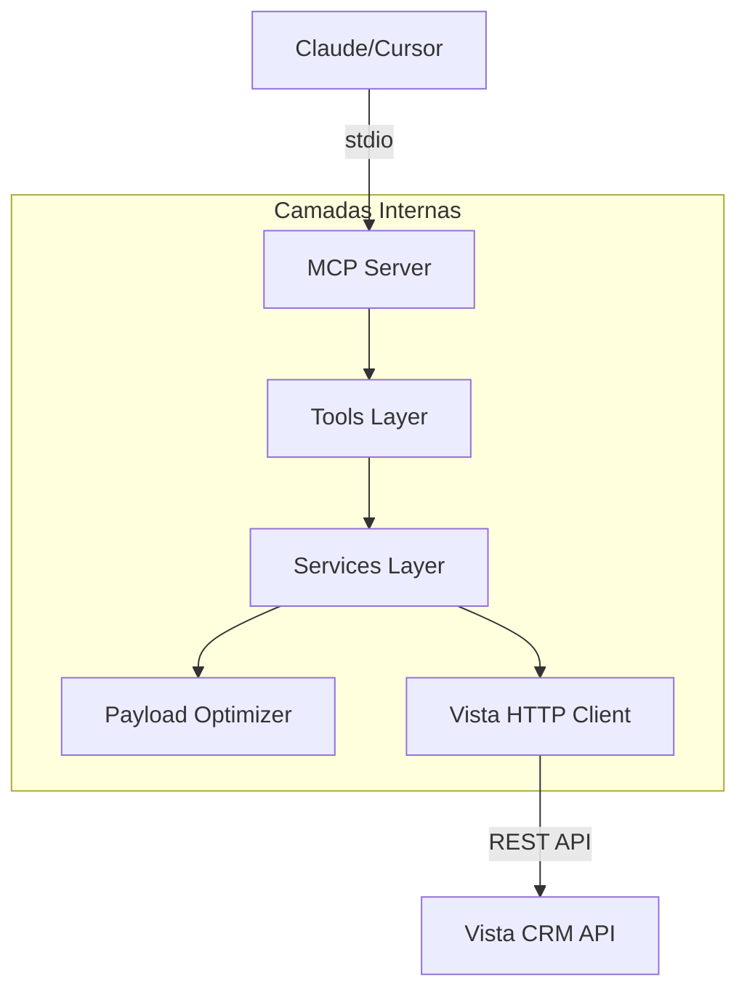

# MCP Server - Vista CRM 🏠🚀

[](https://opensource.org/licenses/MIT)
[](https://modelcontextprotocol.io)
[](https://www.typescriptlang.org/)

Integração de nível empresarial com a **API Vista CRM**, projetada para agentes de IA que precisam gerenciar operações imobiliárias com precisão, segurança e economia de tokens.

---

## 🏗️ Arquitetura do Produto

Este servidor MCP foi construído utilizando os princípios de **Clean Architecture**, garantindo que a lógica de negócio esteja totalmente desacoplada dos detalhes de transporte e rede.



### Por que esta arquitetura?
- **Economia de Tokens:** Todas as respostas são processadas pelo `PayloadOptimizer` para remover campos nulos e ruídos.
- **Resiliência:** O `VistaClient` gerencia timeouts, retries e trata erros de negócio camuflados em HTTP 200.
- **Observabilidade:** Logs estruturados em `stderr` permitem monitorar requisições sem quebrar o protocolo JSON-RPC.

---

## 🚀 Guia de Início Rápido

### 1. Requisitos
- Node.js 18 ou superior
- Chave de acesso à API Vista Software

### 2. Configuração
Clone o repositório e configure as variáveis de ambiente:
```bash
git clone https://github.com/fabiohsan-dev/mcp-vista.git
cd mcp-vista
cp .env.example .env
```

Edite o `.env`:
```env
VISTA_URL=https://sua-empresa.vistahost.com.br
VISTA_KEY=sua-chave-api
DEFAULT_LIMIT=20
TIMEOUT_MS=30000
```

### 3. Instalação & Build
```bash
npm install
npm run build
```

---

## 🔌 Configuração nos Agentes

### Claude Desktop
Adicione ao seu `claude_desktop_config.json`:
```json
{
  "mcpServers": {
    "vista-crm": {
      "command": "node",
      "args": ["/caminho/absoluto/dist/index.js"],
      "env": {
        "VISTA_URL": "...",
        "VISTA_KEY": "..."
      }
    }
  }
}
```

---

## 📋 Ferramentas Disponíveis

| Módulo | Ferramenta | Descrição |
|--------|------------|-----------|
| **🏠 Imóveis** | `imoveis_pesquisar` | Busca avançada com filtros granulares. |
| | `imovel_detalhes` | Dados completos de um imóvel específico. |
| **👥 Clientes** | `clientes_pesquisar` | CRM: Busca de contatos e interessados. |
| | `cliente_cadastrar` | Registro de novos clientes no sistema. |
| **📅 Agenda** | `agendamentos_pesquisar` | Visualização de visitas e reuniões. |
| | `agendamento_cadastrar` | Criação de novos compromissos na agenda. |

---

## 🧪 Desenvolvimento & Testes

Para garantir a qualidade, utilizamos **Vitest** para testes unitários:
```bash
# Rodar todos os testes
npm test

# Modo de desenvolvimento
npm run dev
```

---

## 📄 Licença

Distribuído sob a licença MIT. Veja `LICENSE` para mais detalhes.

---

## 👨‍💻 Autor

**Fabio San** - [@fabiohsan-dev](https://github.com/fabiohsan-dev)

*Este é um projeto independente e não possui vínculo oficial com a Vista Software.*
